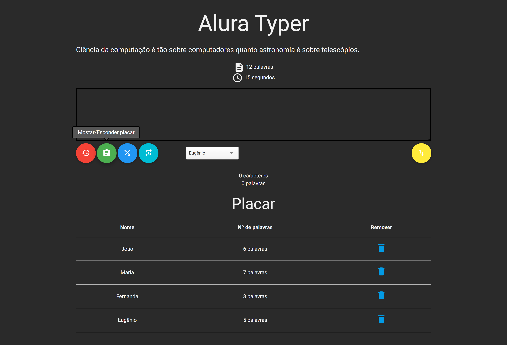

# Curso de jQuery: domine a biblioteca mais popular do mercado parte 1


## Conteúdo visto:

<ul>
  <li> Domine a biblioteca do desenvolvimento Web mais popular do mercado
  <li> Entenda a diferença entre as várias versões do jQuery e saiba qual usar
  <li> Aprenda a criar, remover e manipular elementos da página
  <li> Saiba como escutar os diversos eventos de uma página
  <li> Mude o estilo de seus elementos dinamicamente
  <li> Aprenda boas práticas no uso do jQuery e do Javascript
  <li> Crie um jogo do zero enquanto aprende jQuery
</ul>

<br>
<br>

# Curso de jQuery: avance na biblioteca mais popular do mercado parte 2

## Conteúdo visto:

- Aprenda a trabalhar com as animações nativas do jQuery
- Domine as funções de AJAX do jQuery
- Aprenda a buscar e enviar dados de modo assíncrono para um servidor Web
- Entenda como funcionam os plugins externos e como incorporá-los ao seu projeto
- Trate os erros mais comuns de AJAX e melhore a experiência do seu usuário.

<br>
<br>

# Como utilizar o projeto
Necessário ter o node e o gerenciador de pacotes npm 

link para instalação clique <a href="https://rockcontent.com/br/blog/npm/#3">aqui</a>.

<br>

Navegue até a pasta servidor do projeto
``` 
cd servidor/
```
Iniciar o servidor
``` 
npm start
```

Abrir no navegador o link

http://localhost:3000/principal.html

<br>
<br>

# Preview

